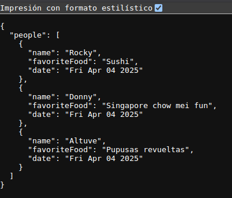
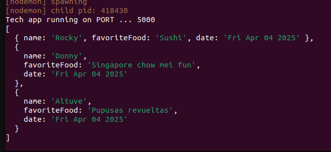

# Technical exercise

  #### Add an object for yourself following a similar format. Put each object in an array so you have an array of objects (your choice how to do that). Iterate through the array of objects adding the date the script was run each object as favorite things may change in the future. Console.log. only active records with the Name, date, Favorite movie of each person. Add a function that can sort the output by object property. There may be a time where no Active records are found. Include code that provides a message when that occurs.

## Introduction
  * This project contains an API, it was developed using NodeJs-Typescript. 
  * For no persisted data a json file `data.json`  is created to load the data from data.ts file since first    running the app.
  * On the get request `data.json` is updated with date property and filtered only displaying active records.
  * If any property (name, date or favriteFood) is passed as param the data is sorted by that property

## How to start?

1. Clone the github repository: 
    ```
      git clone repository-url
    ```
2. Install API dependencies `cd tech-exercise` directory: 
    ```
      npm install
    ```
3. Runing the aplication:
    ```
      npm run dev
    ```
4. For displaying data open a web browser and type `http://localhost:5000/people`
  
  * The data will be displayed on terminal too.


